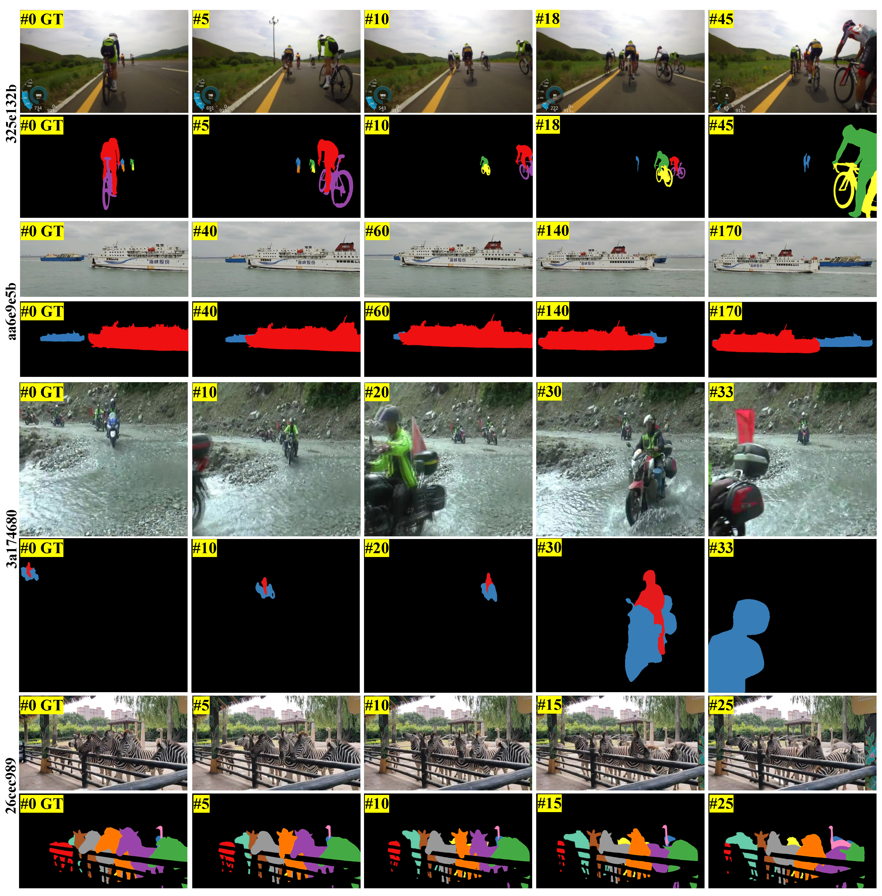
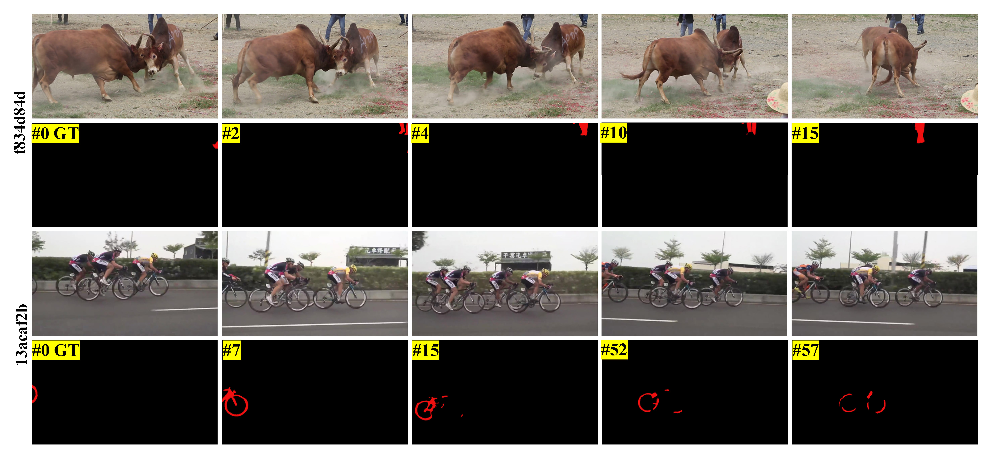

# VOS-Solution
## 🔥🔥🔥 1st Place Solution for MOSE Track in CVPR 2024 PVUW Workshop: Complex Video Object Segmentation

Deshui Miao1,2, [Xin Li](https://sites.google.com/view/xinli-homepage)1,+, [Zhenyu He](https://scholar.google.com/citations?hl=zh-CN&user=cv8_7usAAAAJ)2, [Yaowei Wang](https://scholar.google.com/citations?hl=zh-CN&user=o_DllmIAAAAJ)2, [Ming-Hsuan Yang](https://scholar.google.com/citations?hl=zh-CN&user=p9-ohHsAAAAJ)3

1 [Peng Cheng Laboratory](https://https://www.pcl.ac.cn/) &nbsp; 2 Harbin Institute of Technology, Shenzhen &nbsp; 3 University of California at Merced &nbsp;

+ Team leader

[Report](https://arxiv.org/pdf/2406.04600)

